# About me

👋 Hi there, I’m Tom, or Duc, [Shrimp 🦐](https://translate.google.com/?sl=vi&tl=en&text=t%C3%B4m).  
A Full-stack Developer, who loves making tools, games and tinkering with new techologies in the wild.

My current TODO list:
- [x] Install Neovim
- [x] Learn VimMotion
- [x] Write code ~~blazingly~~ fast

- [ ] Write all things in Go (except frontend) (⌛)

🌱 Things for future me to dig into:

<table>
  <thead>
    <tr><th>Priority</th><th colspan="2">things</th></tr>
  <tbody>
    <tr><td>1.</td><td></td><td></td></tr>
    <tr><td>2.</td><td></td><td></td></tr>
    <tr><td>3.</td><td colspan="2"></td></tr>
    <tr><td>4.</td><td colspan="2"></td></tr>
  </tbody>
</table>

## Some silly stats

